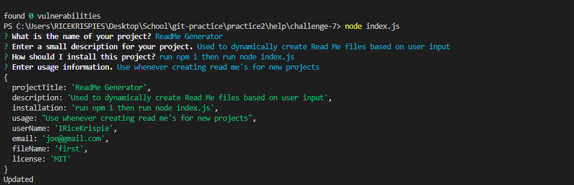

# challenge-7
readMe Generator

## Description
* This application uses node and inquierer to take in input from the user and generate a dynamic readme file based on the user input.

## Initial Instructions
* run 'npm i' in the command line to install dependencies
* run 'node index.js' in the command line to run the application

## Demo
* https://www.youtube.com/watch?v=EvBGhlX4k0o

## GitHub
* Link: https://github.com/IRiceKrispie/challenge-7

## Screenshots

